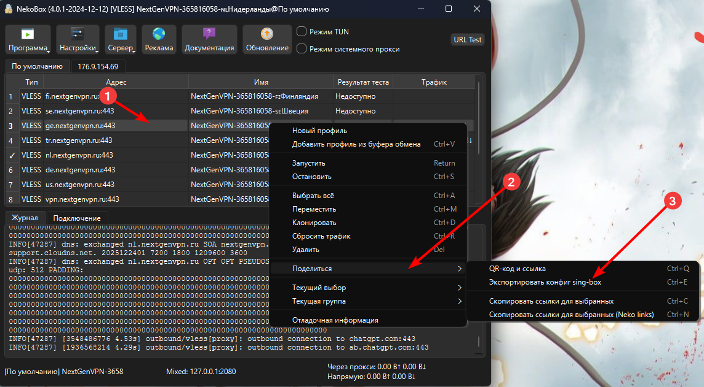
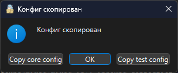

# Sing Box Docker

Позволяет запустить прокси на любом сервере черз docker.

## Введение

Данный гайд разработан для vpn купленных через бота [NextGenVPN](https://t.me/NextGenVPN_bot). 

У вас должен быть установлен NekoBox, и в него добавлена подписка. См. [NextGenVPN для Windows (Nekobox)](https://nextgenvpn.ru/nekobox)

## Быстрый старт

Клонируйте репозиторий

```shell
git clone https://github.com/lavrocoder/sing-box-docker
```

### Настройка конфигурации

1. Открываем NekoBox на локальной машине
2. Выбираем профиль и кликаем по нему правой кнопкой мыши
3. Нажимаем `Поделиться`
4. Нажимаем `Экспортировать конфиг sing-box`
5. Нажимаем `ОК`


6. В проекте (на нужной машине) создаём файл `config.json`
7. Вставляем скопированное в файл
8. В файле нужно обновить блок `inbounds[0].listen`: `127.0.0.1` → `0.0.0.0`

### Запуск
Выполните команду

```shell
docker compose up -d --build
```